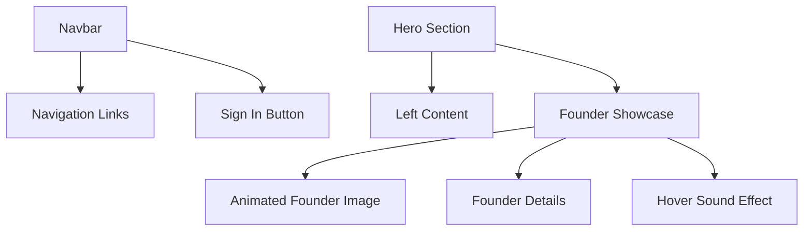

# Physics Wallah — Modern Landing Page Redesign

A modern responsive redesign inspired by the Physics Wallah website, built using pure HTML, CSS, and JavaScript.

This project focuses on creating a cleaner visual experience with interactive UI effects, responsive layouts, hover animations, and immersive audio interactions.

---

# Preview


## Desktop Layout

* Modern navbar
* Responsive hero section
* Founder showcase section
* Interactive hover animations
* Hover-triggered sound effects

---

# Features

* Responsive landing page design
* Interactive navigation
* Founder spotlight section
* Smooth image hover animation
* Hover sound effect on founder image
* Clean typography and spacing
* JavaScript-based navigation handling
* Mobile responsive layout

---

# Tech Stack

```txt
HTML5
CSS3
JavaScript
```

---

# Project Structure

```plaintext
project/
│
├── assets/
│   ├── Logo.webp
│   ├── alakh.png
│   └── hover.mp3
│
├── index.html
├── style.css
└── script.js
```

---

# UI Architecture



---

# Hover Interaction

The founder image contains:

* Smooth scale animation
* Hover-triggered audio
* Audio reset on mouse leave

Implemented using:

```javascript
mouseenter
mouseleave
audio.play()
audio.pause()
```

---

# Responsive Design

## Desktop

* Two-column hero layout
* Large typography
* Expanded navbar

## Mobile

* Column-based stacking
* Simplified navigation
* Optimized spacing

---

# Learning Outcomes

Through this project, I practiced:

* Flexbox layouts
* Responsive design
* CSS transforms & transitions
* DOM event handling
* Audio handling in JavaScript
* Component-style UI structuring

---

# Future Improvements

* Hamburger menu
* GSAP animations
* Dark mode
* Accessibility improvements
* Better mobile interactions
* Loader animation
* Page transitions

---

# Run Locally

```bash
git clone <your-repository-link>

cd project-folder
```

Then open:

```plaintext
index.html
```

in your browser.

---

# Author

Adarsh Kumar Jha

Frontend Developer • React Learner • UI Enthusiast

